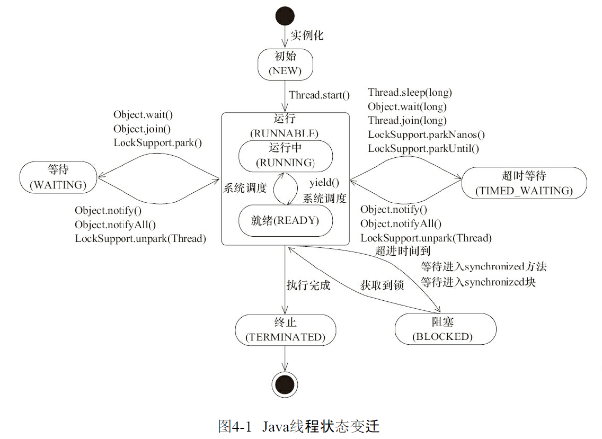

# 线程与并发

## 创建线程的几种方法

### Thread

1. 创建Thread类的子类，覆盖run方法，run方法中执行的内容就是线程执行的内容
2. 创建子类的实例
3. 调用实例的 run 方法，启动线程

```javascript
public class ThreadTest extends Thread {
    @Override
    public void run () {
        System.out.println("OK");
    }
}

public class Main {
    public static void main (String[] args) {
        ThreadTest threadTest = new ThreadTest();
        threadTest.start();
    }
}
```

### Runnable

1. 创建 Runnable 接口的实现类，覆盖run方法，run方法中执行的内容就是线程执行的内容
2. 创建实现类的实例，用这个实例作为Thread的构造器参数创建Thread实例
3. 调用 Thread 实例的 run 方法，从而启动线程

```javascript
public class ThreadTest implements Runnable {
    @Override
    public void run () {
        System.out.println("OK");
    }
}

public class Main {
    public static void main (String[] args) {
        Thread thread = new Thread(new ThreadTest());
        thread.start();
    }
}
```

### Callable

> Callable接口会返回范型V结果，比如我们想让子线程去计算从1加到100，并把算出的结果返回到主线程

```javascript
public class ThreadTest implements Callable {
    @Override
    public Integer call() throws Exception {
        System.out.println("Thread starts");
        Thread.sleep(1000);
        int sum = 0;
        for (int i = 0; i <= 100; i++) {
            sum += i;
        }
        System.out.println("Thread returns");
        return sum;
    }
}

public class Main {
    public static void main(String[] args) {
        ThreadTest threadTest = new ThreadTest();
        FutureTask<Integer> futureTask = new FutureTask<>(threadTest);
        Thread thread = new Thread(futureTask);
        thread.start();

        try {
            System.out.println("before futureTask.get()");
            System.out.println("sum:" + futureTask.get());
            System.out.println("after futureTask.get()");
        } catch (InterruptedException e) {
            e.printStackTrace();
        } catch (ExecutionException e) {
            e.printStackTrace();
        }
    }
}
```

> 主线程调用 futureTask.get\(\) 方法时阻塞主线程，然后 Callable 内部开始执行，并返回运算结果，此时futureTask.get\(\) 得到结果，主线程恢复运行；并且与Runnable接口相比，Callable有返回结构，会抛出异常

_PS:  启动线程需要调用Thread.start\(\)，调用Thread.run\(\)只会执行run方法，不会创建新线程_

## Java 中线程的几种状态

### NEW（新建）

> Thread state for a thread which has not yet started
>
> 创建后还没有启动的线程

### RUNNABLE（可运行）

> Thread state for a runnable thread
>
> 可运行的线程。（调用start\(\)后，线程可能正在运行，也可能正在等待CPU调度，都属于RUNNABLE状态）

### BLOCKED（阻塞）

> Thread state for a thread blocked waiting for a monitor lock
>
> 当线程尝试进入synchronized块/方法时，锁被其他线程占有，当前线程就会被阻塞

### WAITING（等待）

> 等待的线程，需要被其他线程唤醒，不会被分配CPU时间的线程，这种状态通常是指一个线程拥有对象锁后进入到相应的代码区域后，调用相应的“锁对象”的wait\(\)方法操作后产生的一种结果Thread state for a waiting thread

### TIMED\_WAITING（限时等待）

> Thread state for a waiting thread with a specified waiting time
>
> 限期等待的线程，一定时间后会由系统自动唤醒

### TERMINATED（终止）

> Thread state for a terminated thread
>
> 终止的线程

### 线程状态转换图

> 摘自《Java 并发编程的艺术》—— 方腾飞



## 进程与线程

### 基本概念

* 进程：CPU资源分配的最小单位。进程是程序执行时的一个实例，即它是程序已经执行到何种程度的数据结构的汇集。从内核的观点看，进程的目的就是担当分配系统资源（CPU时间、内存等）的基本单位。
* 线程：CPU调度的最小单位。线程是进程的一个执行流，是CPU调度和分派的基本单位，它是比进程更小的能独立运行的基本单位。一个进程由几个线程组成（拥有很多相对独立的执行流的用户程序共享应用程序的大部分数据结构），线程与同属一个进程的其他的线程共享进程所拥有的全部资源。

### 多进程与多线程

<table>
  <thead>
    <tr>
      <th style="text-align:left">对比维度</th>
      <th style="text-align:left">多进程</th>
      <th style="text-align:left">多线程</th>
      <th style="text-align:left">总结</th>
    </tr>
  </thead>
  <tbody>
    <tr>
      <td style="text-align:left">数据共享、同步</td>
      <td style="text-align:left">
        <p>数据共享复杂，需要用IPC；</p>
        <p>数据是公开的，同步简单</p>
      </td>
      <td style="text-align:left">
        <p>因为共享进程数据，数据共享简单，</p>
        <p>但也因此导致同步复杂</p>
      </td>
      <td style="text-align:left">各有优势</td>
    </tr>
    <tr>
      <td style="text-align:left">内存、CPU</td>
      <td style="text-align:left">
        <p>占用内存多，切换复杂；</p>
        <p>CPU利用率低</p>
      </td>
      <td style="text-align:left">占用内存少，切换简单，CPU利用率高</td>
      <td style="text-align:left">线程占优</td>
    </tr>
    <tr>
      <td style="text-align:left">创建销毁、切换</td>
      <td style="text-align:left">创建销毁、切换复杂；速度慢</td>
      <td style="text-align:left">创建销毁、切换简单、速度快</td>
      <td style="text-align:left">线程占优</td>
    </tr>
    <tr>
      <td style="text-align:left">编程、调试</td>
      <td style="text-align:left">编程简单，调式简单</td>
      <td style="text-align:left">编程复杂，调试复杂</td>
      <td style="text-align:left">进程占优</td>
    </tr>
    <tr>
      <td style="text-align:left">可靠性</td>
      <td style="text-align:left">进程间不会互相影响</td>
      <td style="text-align:left">一个线程挂掉可能导致整个进程挂</td>
      <td style="text-align:left">进程占优</td>
    </tr>
    <tr>
      <td style="text-align:left">分布式</td>
      <td style="text-align:left">
        <p>适用于多核、多机分布式；</p>
        <p>如果一台机器不够，扩展到多台</p>
        <p>机器比较简单</p>
      </td>
      <td style="text-align:left">适用于多核分布式</td>
      <td style="text-align:left">进程占优</td>
    </tr>
  </tbody>
</table>#### 需要频繁创建销毁的优先线程

> 最常见的应用就是Web服务器了，来一个连接建立一个线程，断了就销毁线程，要是用进程，创建和销毁的代价是很难承受的

#### 需要进行大量计算的优先线程

> 大量计算：耗费较多很多CPU资源，切换频繁
>
> 案例：图像处理、算法计算等

#### 强相关的处理用线程，弱相关的处理用进程

> 案例：一般的Server需要完成如下任务：消息收发、消息处理。“消息收发”和“消息处理”就是弱相关的任务，而“消息处理”里面可能又分为“消息解码”、“业务处理”，这两个任务相对来说相关性就要强多了。因此“消息收发”和“消息处理”可以分进程设计，“消息解码”、“业务处理”可以分线程设计（摘自 [燕燕于飞差池其羽](https://www.zhihu.com/people/hu-qin-2)）

## 进程间通信

IPC（Inter-Process Communication）

### 管道通信

### 命名管道通信

### 信号

### 消息队列

### 共享内存

### 信号量

### 套接字

