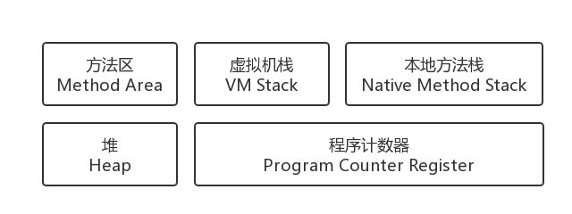

# JVM 虚拟机

## 内存区域

### Java 虚拟机运行时数据区

### 程序计数器（Program Counter Register）

* 当前线程所执行的字节码的行号指示器
* 通过改变计数器的值来选择下一条需要执行的字节码指令（分支、循环、跳转、异常处理、线程恢复）
* 线程私有： 为了线程切换后能恢复到正确的执行位置，每条线程都需要有一个独立的程序计数器，各条线程之间计数器互不影响，独立存储
* 没有 OutOfMemoryError（唯一一个没有规范任何 OOM 情况的区域）
* 如果线程正在执行的是一个Java方法，这个计数器记录的是正在执行的虚拟机字节码指令的地址；如果正在执行的是Native方法，这个计数器值则为空（Undefined）

## 类加载器

