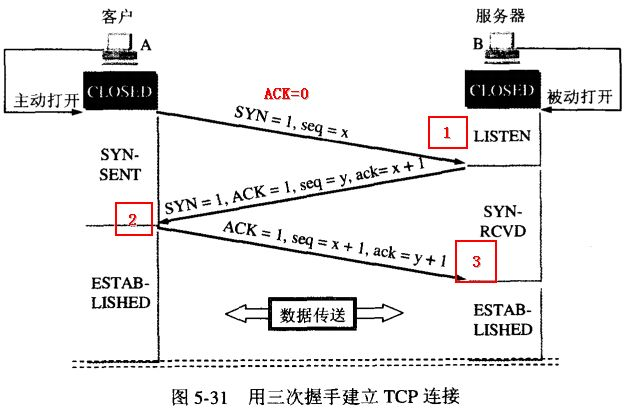

# TCP 与 UDP

## TCP 与 UDP

### TCP 与 UDP 的区别

* TCP 是面向连接的（三次握手、四次挥手），UDP是无连接的（直接发送数据）
* TCP 提供可靠的服务（重传机制、拥塞控制等），UDP不可靠
* TCP占用资源多（首部20字节），UDP较少（首部8字节）
* TCP是点到点的，UDP支持一对一、一对多、多对一、多对多
* UDP实时性更好（因为没有拥塞控制，网络发生拥塞不会降低主机的发送速率）

### TCP 三次握手

#### 名词解释

* SYN：_Synchronize Sequence Numbers，同步序列编号，建立连接的标志_
* FIN：_Finish，关闭连接的标志_
* ACK：_Acknowledgement，确认接收的标志_
* Seq：_Sequence Number，序列号_

#### 示意图

#### 为什么要三次握手

* 一次握手

> 客户端无法判断服务器是否收到请求消息，所以无法建立连接

* 两次握手

> 一端\(client\)A发出去的第一个连接请求报文并没有丢失，而是因为某些未知的原因在某个网络节点上发生滞留，导致延迟到连接释放以后的某个时间才到达另一端\(server\)B。本来这是一个早已失效的报文段，但是B收到此失效的报文之后，会误认为是A再次发出的一个新的连接请求，于是B端就向A又发出确认报文，表示同意建立连接。如果不采用“三次握手”，那么只要B端发出确认报文就会认为新的连接已经建立了，但是A端并没有发出建立连接的请求，因此不会去向B端发送数据，B端没有收到数据就会一直等待，这样B端就会白白浪费掉很多资源

* 三次握手

> 当网络发生拥堵会出现以下情况：
>
> 第一次握手，如果A发给B的SYN没有到达B，此时过了一段时间后A收不到B回传的SYN+ACK，所以A会周期性超时重传SYN，直到收到B的SYN+ACK。
>
> 第二次握手，如果B发给A的SYN+ACK没有到达A，此时过了一段时间后B收不到A回传的SYN+ACK，所以B会周期性超时重传SYN+ACK，直到收到A的SYN+ACK。
>
> 第三次握手，如果A发给B的ACK没有到达B，此时A发完ACK，单方面认为TCP为 Established状态，而B还在等待A的ACK，所以此时会出现以下三种情况：
>
> 假定此时双方都没有数据发送，B会周期性超时重传SYN+ACK，直到收到A的ACK，收到之后B的TCP 连接也为 Established状态，双方可以发包。
>
> 假定此时A有数据发送，B收到A的 Data+ACK，自然会切换为Established 状态，并接收A的Data。
>
> 假定此时B有数据发送，因为没有建立连接所以数据发送不了，会一直周期性超时重传SYN+ACK，直到收到A的ACK才可以发送数据。

### TCP 四次挥手

#### 示意图

#### 为什么TIME\_WAIT状态需要经过2MSS\(最大报文段生存时间\)才能返回到CLOSE？

